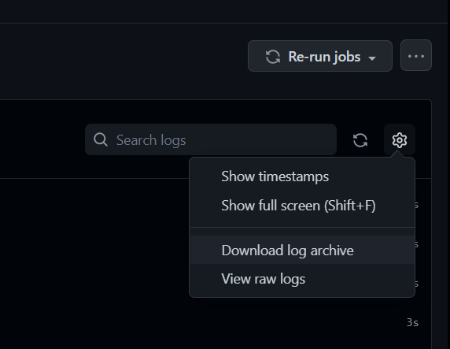

# Markdown link check log parser

[](https://github.com/edumserrano/markdown-link-check-log-parser/actions/workflows/build-test.yml)
[](https://codecov.io/gh/edumserrano/markdown-link-check-log-parser)
[](https://github.com/marketplace/actions/markdown-link-check-log-parser)
<!-- 
[](https://github.com/edumserrano/github-issue-forms-parser/actions/workflows/test-action.yml)
[](https://codecov.io/gh/edumserrano/github-issue-forms-parser)
-->

[](./LICENSE)
[](https://github.com/sponsors/edumserrano)
[](https://www.linkedin.com/in/eduardomserrano/)

A Docker container [GitHub action](https://docs.github.com/en/actions/learn-github-actions/finding-and-customizing-actions) that can be used to parse the log from a [GitHub Action - Markdown link check](https://github.com/gaurav-nelson/github-action-markdown-link-check) step.

As of writing this, the [GitHub Action - Markdown link check](https://github.com/gaurav-nelson/github-action-markdown-link-check) doesn't provide information from the Markdown link check as output of the action and there's even a long outstanding [open issue about it](https://github.com/gaurav-nelson/github-action-markdown-link-check/issues/9). This action is an alternative solution for that issue.

## Usage

```yml
- name: Run Markdown Link Check log parser
  id: mlc-log-parser
  uses: edumserrano/markdown-link-check-log-parser@v1
  with:
    auth-token:  ${{ secrets.GITHUB_TOKEN }}
    repo: '<repo-name>'
    run-id: '<run-id>'
    job-name: '<job-name>'
    step-name: '<step-name>'
# The next step is using powershell to parse the action's output but you can use whatever you prefer.
# Note that in order to read the step outputs the action step must have an id.
- name: Output parsed issue
  shell: pwsh
  run: |
    $result = '${{ steps.mlc-log-parser.outputs.mlc-result }}' | ConvertFrom-Json
    Write-Output "Total files checked: $($result.TotalFilesChecked)"
    Write-Output "Total links chedked: $($result.TotalLinksChecked)"
    Write-Output "Has erros: $($result.HasErrors)"
    $resultAsJsonIndented = ConvertTo-Json -Depth 4 $result
    Write-Output $resultAsJsonIndented # outputs the markdown link check result as an indented JSON string
    ...
```

### Action inputs

<!-- the &nbsp; is a trick to expand the width of the table column. You add as many &nbsp; as required to get the width you want. -->
| Name &nbsp; &nbsp; &nbsp; &nbsp; &nbsp; &nbsp; &nbsp; &nbsp; &nbsp; &nbsp; &nbsp; &nbsp; &nbsp; &nbsp; &nbsp; &nbsp; | Description | Required | Default
| --- | --- | --- | --- |
| `auth-token` | GitHub token used to access workflow run logs. | yes | ---
| `repo` | The repository for the workflow run in the format of {owner}/{repo}. | yes | ---
| `run-id` | The unique identifier of the workflow run that contains the markdown link check step. | yes | ---
| `job-name` | The name of the job that contains the markdown link check step. | yes | ---
| `step-name` | The name of the markdown link check step. | yes | ---
| `only-errors` | Whether the output information contains file errors only or all files. | no | true
| `output` | How to output the markdown file check result. It must be one of or a comma separated list of the following values: step,json,md. | no | step
| `json-filepath` | The filepath for the output JSON file. | no | ---
| `markdown-filepath` | The filepath for the output markdown file. | no | ---

### Action outputs

| Name | Description
| --- | --- |
| `mlc-result` | The result from the Markdown Link Check action in JSON format. |

Note that the action also allows outputing the result from the Markdown Link Check action into a JSON file or into a Markdown files through the use of the appropriate action inputs.

<!--
## Example usages of this action in GitHub workflows

- [This workflow](https://github.com/edumserrano/github-issue-forms-parser/blob/main/.github/workflows/test-action.yml) is used to test that the action works as expected.
- [This workflow](https://github.com/edumserrano/dot-net-sdk-extensions/blob/33303189c564989fd40fcb1fa5086ca443f7bd92/.github/workflows/nuget-release.yml#L69-L73) shows the usage of the action as part of the release flow of a NuGet package.
-->

## I can't figure out the right job name and step name to use

You can download the logs from your workflow by:

1) Go into the job of of the workflow where you are running the [Markdown Link Check](https://github.com/gaurav-nelson/github-action-markdown-link-check) action.
2) Select the cog wheel that shows on the top right and you will see an option to download the logs as shown by the image below.



You can then extract the log zip file and you can find which file contains the log for the Markdown Link Check step.
The job name will be equal to the folder name where the Markdown Link Check step log is.
The step name will be equal to the name of the log file for the Markdown Link Check step but without the prefix for the 'number_'.

**Example:**

If the log file for the Markdown Link Check step is named `5_Markdown link check.txt` and this file is inside a folder named `Check links` then the action inputs should be:

- job-name: 'Check links'
- step-name: 'Markdown link check'

## Dev notes

For notes aimed at developers working on this repo or just trying to understand it go [here](/docs/dev-notes/README.md). It will show you how to build and run the solution among other things.
